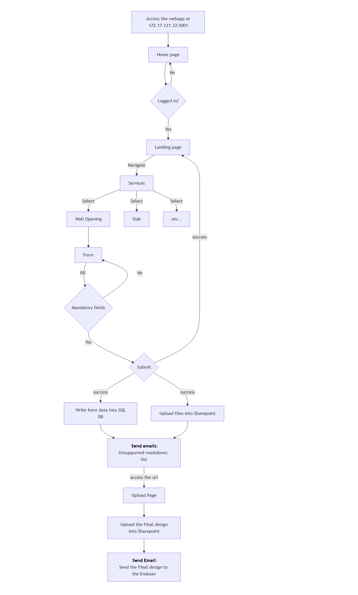

# Final Documentation

## Table of Contents

- [FlowChart](#flowchart)
- [server](#server)

  - [config.js](#configjs)
  - [dbconfig.js](#dbconfigjs)
  - [server.js](#serverjs)
  - [hashpassword.js](#hashpasswordjs)
  - [auth.js](#authjs)
  - [routes.js](#routesjs)
  - [adobe.js](#adobejs)
  - [graph.js](#graphjs)
  - [utils/auth.js](#utilsauthjs)
  - [utils.js](#utilsjs)
  - [dlt.js](#dltjs)
  - [src](#src)

- [client](#client)

  - [index.js](#indexjs)
  - [api.js](#apijs)
  - [views/index.js](#viewsindexjs)
  - [upload.js](#uploadjs)
  - [wo.js](#wojs)

## FlowChart



# server

This section provides documentation for each JavaScript file related to the server-side functionality. It includes details about the purpose, structure, and usage of the server components.

## File Structure

Within the server folder you'll find the following directories and files:

```

server
└──
  ├── server.js
  ├── dbconfig.js
  ├── config.js
  ├── package-lock.json
  ├── package.json
  ├── routes
  │   ├── auth.js
  │   └── routes.js
  ├── src
  │   ├── bs+
  │   |   ├── B5+doubleLoad.asc
  │   |   └── B5+singleleLoad.asc
  │   ├── dlt+
  │   │   ├── DLTplusDualspanSteel.flx
  │   │   └── DLTplusSinglespanSteel.flx
  │   └── docx
  │       ├── CardsFooter.js
  │       ├── LoadCalculation.docx
  │       ├── UserEnteredData.docx
  │       └── WanddurchbruecheMW-instructions.pdf
  └── utils
      ├── auth.js
      ├── dlt.js
      └── utils.js
```

# config.js

This section provides an overview of the `config.js` file, which is responsible for loading and validating environment variables required for the server to run.

## Overview

The `config.js` file uses the `dotenv` package to load environment variables from a `.env` file into `process.env`. It then extracts specific variables and checks if they are defined. If any required variables are missing, the server will log a warning and exit.

## Environment Variables

The following environment variables are loaded and validated:

- `JWT_KEY`: Secret key for JSON Web Tokens.
- `PORT`: Port number on which the server will run.
- `GRAPH_CLIENTID`: Client ID for Microsoft Graph API.
- `GRAPH_CLIENTSECRET`: Client Secret for Microsoft Graph API.
- `GRAPH_TENANTID`: Tenant ID for Microsoft Graph API.
- `SHAREPOINT_SITEID`: Site ID for SharePoint.
- `SHAREPOINT_PARENTITEM`: Parent item ID for SharePoint.
- `EMAIL`: Email address used by the server.
- `ADOBE_CLIENTID`: Client ID for Adobe API.
- `ADOBE_CLIENTSECRET`: Client Secret for Adobe API.

## Flow

1. **Load Environment Variables**: The `dotenv` package loads variables from a `.env` file.
2. **Extract Variables**: Specific environment variables are extracted from `process.env`.
3. **Validation**: The script checks if all required variables are defined. If any are missing, it logs a warning and exits the process.
4. **Export Configuration**: The validated variables are exported as a module for use in other parts of the application.

## Important Functions

- **Validation Check**: Ensures that all required environment variables are defined. If not, it logs a warning and exits the process.

## Example

Here is an example of how the configuration might be used in another part of the application:

```javascript
const config = require("./config");

console.log(`Server running on port ${config.PORT}`);
```

This ensures that the server has access to all necessary configuration settings.

# dbconfig.js

dbconfig.js script configures and establishes a connection to an MSSQL database using environment variables for configuration.

## Code Flow

1. **Environment Variables**:

   - The script loads database configuration values (DBNAME, DBUSER, DBPASSWORD, DBHOST) from environment variables.
   - If any of these variables are missing, a warning is logged, and the process exits.

2. **Database Configuration**:

   - The script sets up the database configuration object with the necessary details such as user, password, server, and database name.
   - Additional options like `encrypt` and `trustServerCertificate` are included for secure connections.

3. **Connection Pool**:
   - The script creates a connection pool using the `mssql` library and attempts to connect to the database.
   - If the connection is successful, a message is logged to the console.
   - If the connection fails, an error message is logged.

## Important Functions

- **sql.ConnectionPool(dbConfig).connect()**:
  - Creates and returns a connection pool for the MSSQL database using the provided configuration.
  - Used to manage and reuse database connections efficiently.

## Error Handling

- The script includes error handling for missing environment variables and database connection failures, logging appropriate error messages to the console.

# server.js

This section provides an overview of the `server.js` file, explaining its structure and flow.

## Overview

The `server.js` file sets up an Express server to serve static files and handle API routes. It also includes middleware for handling JSON requests, enabling CORS, and serving the React application's `index.html` for non-API routes.

## Code Flow

1. **Express App Initialization**: The Express application is initialized and middleware for JSON parsing and CORS is added.

   ```javascript
   const app = express();
   app.use(express.json());
   app.use(cors());
   ```

2. **Serving Static Files**: The server is configured to serve static files from the `client/build` directory.

   ```javascript
   const buildPath = path.join(__dirname, "../client/build");
   app.use(express.static(buildPath));
   ```

3. **API Routes**: API routes are defined and imported from separate route files. These routes are prefixed with `/api`.

   ```javascript
   app.use("/api", require("./routes/auth"));
   app.use("/api", require("./routes/routes"));
   ```

4. **React Router Fix**: For non-API routes, the server serves the `index.html` file to support client-side routing in the React application.

   ```javascript
   app.get("*", (req, res) => {
     res.sendFile(path.join(buildPath, "index.html"));
   });
   ```

5. **Error Handling**: A centralized error handler is defined to catch and respond to errors.

   ```javascript
   app.use((err, req, res, next) => {
     if (res.headersSent) {
       return next(err);
     }
     res.status(err.status || 500).send({ error: err.message, details: err.details });
   });
   ```

6. **Server Listening**: The server listens on a specified port, which is defined in the configuration file or defaults to `5002`.
   ```javascript
   const port = config.PORT || 5002;
   app.listen(port, () => {
     console.log(`Server started on port ${port}`);
   });
   ```

## Important Middleware and Functions

- **express.json()**: Middleware to parse incoming JSON requests.
- **cors()**: Middleware to enable Cross-Origin Resource Sharing.
- **express.static()**: Middleware to serve static files.
- **Centralized Error Handler**: Captures and handles errors, sending a JSON response with error details.

This setup ensures that the server can handle both API requests and serve the React application efficiently.

# hashpassword.js

hashpassword.js script connects to a SQLite database containing user information, retrieves all users, hashes their passwords using bcrypt, and updates the database with the hashed passwords.

## Code Flow

1. **Database Connection**:

   - The script establishes a connection to the SQLite database located at `./db/users.db`.
   - If the connection is successful, a message is logged to the console.

2. **Retrieve Users**:

   - The script retrieves all user records from the `users` table in the database.

3. **Hash Passwords**:

   - For each user, the script hashes the user's password using bcrypt with a salt rounds value of 10.

4. **Update Database**:
   - The script updates the `users` table with the hashed password for each user.
   - If the update is successful, a message is logged to the console indicating the user's email whose password was updated.

## Important Functions

- **bcrypt.hashSync(password, saltRounds)**:

  - Synchronously generates a hash for the given password using the specified number of salt rounds.
  - Used to securely hash user passwords before storing them in the database.

- **db.run(sql, params, callback)**:
  - Executes an SQL query with the provided parameters.
  - Used to update the user's password in the database.

## Error Handling

- The script includes error handling for database connection errors and SQL query execution errors, logging appropriate error messages to the console.

# auth.js

This file defines the authentication routes for the application using Express.js. It includes routes for user registration and login.

## Routes

### POST /api/register

This route handles user registration. It uses the `userRegisterMiddleware` to process the registration request. Upon successful registration, it responds with a status of 200 and includes the authentication token and user information in the response.

### POST /api/login

This route handles user login. It uses the `loginMiddleware` to process the login request. Upon successful login, it responds with a status of 200 and includes the authentication token and user information in the response.

## Middlewares

### userRegisterMiddleware

This middleware is responsible for handling the user registration logic. It processes the registration data, creates a new user, and generates an authentication token.

### loginMiddleware

This middleware is responsible for handling the user login logic. It processes the login credentials, verifies the user, and generates an authentication token.

## Summary

The `auth.js` file sets up two main routes for user authentication: registration and login. It utilizes middlewares to handle the core logic for these processes and responds with the necessary authentication details upon success.

# routes.js

This document provides an overview of the routes defined in `routes.js` and their functionalities.

## Overview

The `routes.js` file defines several API endpoints for handling requests related to file uploads, request processing, and SharePoint interactions. The routes are implemented using Express.js and utilize various middleware and utility functions.

## Routes

### POST /api/requests

- **Middleware**: `requestsMiddleware`
- **Description**: Generates a new request ID and returns it in the response.
- **Response**:
  - `200 OK`: `{ success: true, requestId }`
  - `500 Internal Server Error`: `{ success: false, message: "Unexpected error occurred" }`

### POST /api/upload

- **Middleware**: `requestsAssignedByMiddleware`
- **Description**: Handles file uploads, processes the files, and sends an email to the user with the final file.
- **Request Body**:
  - `requestId`: The ID of the request.
  - `files`: The files to be uploaded.
- **Response**:
  - `200 OK`: `{ message: "File uploads successful and emailed the user" }`
  - `500 Internal Server Error`: `{ message: "An unexpected error occurred", error: error.message }`

### POST /api/wo

- **Middleware**: `insertWallOpeningDataMiddleware`, `loadCalculationMiddleware`
- **Description**: Handles wall opening requests, processes the files, updates templates, and sends an email with the results.
- **Request Body**:
  - `requestId`: The ID of the request.
  - `files`: The files to be uploaded.
  - Additional fields related to wall opening data.
- **Response**:
  - `200 OK`: Returns the generated PDF.
  - `500 Internal Server Error`: `{ error: "Failed to upload files", details: error.message }`

## Important Functions and Middleware

### ensureGraphAuthInitialized

- **Description**: Ensures that the Graph API authentication is initialized before making any requests.

### uploadFiles

- **Description**: Uploads files to SharePoint, handling both small and large files.

### processFiles

- **Description**: Processes uploaded files, converts them to PDF if necessary, and merges them with an instruction PDF.

### createSharepointFolders

- **Description**: Creates necessary folders in SharePoint for storing user inputs and Kevee outputs.

### handleFriloTemplateUpdate

- **Description**: Updates the Frilo template with user-provided data and uploads the modified template to SharePoint.

### generateUserEnteredPDF

- **Description**: Generates a PDF from user-entered data and uploads it to SharePoint.

## Error Handling

The routes include error handling to catch and log unexpected errors, returning appropriate error messages to the client.

# adobe.js

This document provides an overview of the `adobe.js` service, which is responsible for converting DOCX files to PDF using Adobe PDF Services.

## Overview

The `adobe.js` service contains a function `convertDocxToPdf` that converts DOCX files to PDF format. The function can handle both file paths and in-memory files.

## Functions

### convertDocxToPdf

This is the main function of the service. It accepts an object with two optional properties: `_docxFilePath` and `_memoryFile`.

- **\_docxFilePath**: The file path of the DOCX file to be converted.
- **\_memoryFile**: An in-memory file object containing the DOCX file data.

The function performs the following steps:

1. Determines the input source (file path or in-memory file) and creates a read stream.
2. Initializes Adobe PDF Services credentials using `ServicePrincipalCredentials`.
3. Uploads the DOCX file to Adobe PDF Services.
4. Submits a job to convert the DOCX file to PDF.
5. Polls for the job result and retrieves the converted PDF.
6. Creates a PassThrough stream to duplicate the read stream.
7. Converts one of the PassThrough streams to a buffer.
8. Returns an object containing the read stream, buffer, original file name, and size of the buffer.

### streamToBuffer

A helper function that converts a stream to a buffer. It listens to the stream's data, end, and error events to accumulate the data chunks and resolve them as a single buffer.

## Error Handling

The `convertDocxToPdf` function includes error handling to log and rethrow errors encountered during the conversion process.

## Export

The service exports the `convertDocxToPdf` function for use in other parts of the application.

# graph.js

This document provides an overview of the `graph.js` service, which is responsible for interacting with Microsoft Graph API to manage SharePoint sites, files, and sending emails.

## Overview

The `graph.js` service contains various functions to perform operations such as retrieving SharePoint sites, managing files, and sending emails using Microsoft Graph API.

## Initialization

### initializeGraphForAppOnlyAuth

This function initializes the Microsoft Graph client for app-only authentication using `ClientSecretCredential` from Azure Identity.

## Functions

### getAccessToken

This function retrieves an access token for Microsoft Graph API. It refreshes the token if it is null or expired.

### getSites

This function retrieves the SharePoint sites associated with the authenticated user.

### getChildrentItems

This function retrieves the child items of a specified parent item in SharePoint.

### getContent

This function retrieves the content of a specified item in SharePoint. It can optionally format the content.

### searchItems

This function searches for items in SharePoint based on a query string.

### createFolder

This function creates a new folder in SharePoint under a specified parent item.

### uploadSmallFile

This function uploads a small file to SharePoint under a specified parent item. It handles files that can be uploaded in a single request.

### uploadLargeFile

This function uploads a large file to SharePoint under a specified parent item. It handles files that need to be uploaded in chunks using an upload session.

### createShareLink

This function creates a shareable link for a specified item in SharePoint. The link can be configured with permissions and scope.

### sendEmailToUser

This function sends an email with an attachment to a specified user. The email includes the user's name and the attached file.

### sendEmail

This function sends an email to a specified recipient with details about a new request. The email includes links to SharePoint and Frilo templates.

## Error Handling

Each function includes error handling to log and rethrow errors encountered during the operations.

## Export

The service exports the functions for use in other parts of the application.

# utils/auth.js

This section provides an overview of the `auth.js` file from `utils`, which defines middleware functions for user authentication, including user registration and login.

## Overview

The `auth.js` file handles user authentication by interacting with the database to register new users and validate login credentials. It uses `bcrypt` for password hashing and comparison, and `jsonwebtoken` for generating authentication tokens.

## Code Flow

### 1. **User Registration** (`userRegisterMiddleware`)

- **Purpose**: Handles the registration of new users.
- **Flow**:
  1. Connects to the database and checks if the provided email already exists.
  2. If the email exists, it responds with an error.
  3. If the email does not exist:
     - Hashes the user's password using `bcrypt`.
     - Inserts the user's details (name, email, hashed password) into the `users` table.
     - Inserts the user's address details into the `address` table.
     - Generates a JSON Web Token (JWT) for the user.
     - Attaches the token and user information to the request object for further processing.
  4. Passes control to the next middleware or route handler.

### 2. **User Login** (`loginMiddleware`)

- **Purpose**: Handles user login by validating credentials.
- **Flow**:
  1. Connects to the database and retrieves the user record based on the provided email.
  2. If no user is found, it responds with a "No user found" error.
  3. If a user is found:
     - Compares the provided password with the stored hashed password using `bcrypt`.
     - If the password is invalid, it responds with an "Invalid password" error.
     - If the password is valid:
       - Generates a JSON Web Token (JWT) for the user.
       - Attaches the token and user information to the request object for further processing.
  4. Passes control to the next middleware or route handler.

## Important Functions and Middleware

### 1. **userRegisterMiddleware**

- **Description**: Handles user registration by validating input, hashing passwords, and storing user details in the database.
- **Key Features**:
  - Prevents duplicate email registration.
  - Hashes passwords securely using `bcrypt`.
  - Generates a JWT for authentication.

### 2. **loginMiddleware**

- **Description**: Handles user login by validating credentials and generating a JWT for authenticated users.
- **Key Features**:
  - Verifies user existence in the database.
  - Compares hashed passwords securely using `bcrypt`.
  - Generates a JWT for session management.

## Error Handling

- Both middleware functions include error handling for database connection issues and invalid input.
- Errors are logged to the console, and appropriate error messages are sent to the client.

## Summary

The `auth.js` file provides middleware for user registration and login, ensuring secure password handling and token-based authentication. These middlewares are essential for managing user authentication in the application.

# utils.js

This section provides an overview of the `utils.js` file, which contains utility functions and middleware for handling various operations such as database interactions, document generation, file merging, and command execution.

## Overview

The `utils.js` file provides a collection of reusable functions and middleware that support the application's core functionalities. These include database operations, generating DOCX files, merging PDFs, and executing external commands.

## Code Flow

### 1. **Middleware for Database Operations**

#### **requestsAssignedByMiddleware**

- **Purpose**: Inserts a record into the `requests_assigned` table to track requests assigned to users.
- **Flow**:
  1. Extracts `requestId` and `submittedBy` from the request body.
  2. Modifies the `requestId` to remove the last part after splitting by `_`.
  3. Inserts the data into the `requests_assigned` table.
  4. Passes control to the next middleware or route handler.

#### **requestsMiddleware**

- **Purpose**: Generates a new request ID and stores it in the `requests` table.
- **Flow**:
  1. Extracts `module` and `email` from the request body.
  2. Inserts a new record into the `requests` table with the current timestamp.
  3. Attaches the generated `requestId` to the request object for further processing.
  4. Passes control to the next middleware or route handler.

### 2. **Database Utility Functions**

#### **getUserDetailsByRequestId**

- **Purpose**: Retrieves user details (name and email) based on a given `requestId`.
- **Flow**:
  1. Queries the `requests` table to get the email associated with the `requestId`.
  2. Queries the `users` table to get the user's full name based on the email.
  3. Returns the user's name and email.

#### **insertSharepointDetails**

- **Purpose**: Inserts SharePoint-related details into the `requests_sharepoint_details` table.
- **Flow**:
  1. Accepts an object containing `requestId`, `parentFolderId`, `userFolderId`, and `keveeFolderId`.
  2. Inserts these details into the database.

#### **getKeveeFolderItemByRequestId**

- **Purpose**: Retrieves the `sp_keveefolder_item` for a given `requestId`.
- **Flow**:
  1. Queries the `requests_sharepoint_details` table to fetch the `sp_keveefolder_item`.
  2. Returns the folder item or `null` if no record is found.

### 3. **Document and File Operations**

#### **docxGenerator**

- **Purpose**: Generates a DOCX file from a template and provided data.
- **Flow**:
  1. Reads a DOCX template file.
  2. Replaces placeholders in the template with the provided data.
  3. Returns the generated DOCX file as a buffer, along with its name and size.

#### **pdfMerger**

- **Purpose**: Merges two PDF files into a single PDF.
- **Flow**:
  1. Loads the PDF buffers.
  2. Copies pages from both PDFs into a new PDF document.
  3. Returns the merged PDF as a buffer.

### 4. **Command Execution**

#### **executeCommand**

- **Purpose**: Executes an external command for a specified module.
- **Flow**:
  1. Constructs the command string using the module name, input path, and output path.
  2. Executes the command using the `child_process` module.
  3. Resolves or rejects the promise based on the command's success or failure.

## Important Functions and Middleware

### Middleware

- **requestsAssignedByMiddleware**: Tracks requests assigned to users by inserting records into the database.
- **requestsMiddleware**: Generates and stores a new request ID in the database.

### Utility Functions

- **getUserDetailsByRequestId**: Fetches user details based on a request ID.
- **insertSharepointDetails**: Stores SharePoint-related details in the database.
- **docxGenerator**: Creates DOCX files from templates.
- **pdfMerger**: Combines multiple PDF files into one.
- **executeCommand**: Runs external commands for specific modules.

## Error Handling

- All database-related functions and middleware include error handling to log and respond to issues such as connection failures or invalid queries.
- File and command operations handle errors by logging them and rejecting promises where applicable.

## Summary

The `utils.js` file provides essential middleware and utility functions for database operations, document generation, file merging, and command execution. These utilities streamline the application's workflow and ensure modular, reusable code.

# dlt.js

This document provides an overview of the `dlt.js` file, which contains utility functions and middleware specifically designed to interact with the DLT+ module from Frilo. These functions handle tasks such as XML file manipulation, load calculations, and database interactions related to wall openings and roof structures.

## Overview

The `dlt.js` file provides a set of tools to support operations for the DLT+ module. It includes functions for modifying XML files, calculating dead and live loads for roof structures, and inserting wall opening data into the database. The file also contains middleware for processing requests related to DLT+.

## Code Flow

### 1. **Load Calculation Functions**

#### **loadCalculator**

- **Purpose**: Calculates the load based on thickness, length, and material density.
- **Usage**: Used as a helper function for calculating dead and live loads.

#### **calcRccFlatroof**

- **Purpose**: Calculates dead and live loads for reinforced concrete flat roofs.
- **Flow**:
  1. Converts input dimensions from centimeters to meters.
  2. Calculates the self-weight of slabs, roofs, and walls based on material density and dimensions.
  3. Computes the total dead load and live load for the roof structure.
  4. Returns the calculated loads along with additional data for further processing.

#### **calcClasssicRoof**

- **Purpose**: Placeholder function for calculating loads for classic roof types.
- **Flow**: Currently returns `null`.

### 2. **XML Manipulation**

#### **XMLModifier**

- **Purpose**: A class for reading, modifying, and generating XML files.
- **Key Methods**:
  - **initialize**: Reads and parses the XML file.
  - **modifyLength**: Modifies the length property in the XML structure.
  - **modifyLoadValues**: Updates dead and live load values in the XML structure.
  - **getModifiedXMLAsBuffer**: Converts the modified XML structure into a buffer for further use.
- **Usage**: Used to modify XML files related to DLT+ configurations and load values.

#### **multispanToSinlglespanFrilo**

- **Purpose**: Converts a multi-span XML configuration to a single-span configuration for Frilo.
- **Flow**:
  1. Removes unnecessary spans, supports, and cross-section labels from the XML structure.
  2. Writes the modified XML to a new file.

### 3. **Middleware Functions**

#### **insertWallOpeningDataMiddleware**

- **Purpose**: Inserts wall opening data into the database.
- **Flow**:
  1. Extracts data from the request body.
  2. Constructs an SQL query to insert the data into the `wo_inputdata` table.
  3. Captures the inserted `requestId` and attaches it to the request body for further processing.
  4. Passes control to the next middleware or route handler.

#### **loadCalculationMiddleware**

- **Purpose**: Calculates dead and live loads for roof structures and attaches the results to the request body.
- **Flow**:
  1. Determines the roof type from the request body.
  2. Calls the appropriate load calculation function (`calcRccFlatroof` or `calcClasssicRoof`).
  3. Generates a DOCX file with the load calculation details using the `docxGenerator` function.
  4. Attaches the calculated loads and generated file to the request body.
  5. Passes control to the next middleware or route handler.

### 4. **Supporting Data**

- **densityMap**: Maps material types (e.g., concrete, masonry) to their respective densities.
- **liveloadMap**: Maps roof and floor types to their respective live load values.

## Important Functions and Middleware

### Functions

- **calcRccFlatroof**: Calculates dead and live loads for reinforced concrete flat roofs.
- **XMLModifier**: A class for reading, modifying, and generating XML files.
- **multispanToSinlglespanFrilo**: Converts multi-span XML configurations to single-span configurations.

### Middleware

- **insertWallOpeningDataMiddleware**: Handles database insertion of wall opening data.
- **loadCalculationMiddleware**: Calculates and attaches load data to the request for further processing.

## Error Handling

- All middleware functions include error handling to log and respond to database or calculation errors.
- XML manipulation functions handle undefined properties gracefully and log warnings when necessary.

## Summary

The `dlt.js` file provides essential utilities and middleware for interacting with the DLT+ module from Frilo. It handles load calculations, XML file modifications, and database operations, ensuring smooth integration with the DLT+ workflow. These tools are critical for processing wall openings and roof structure data efficiently.

# src

The `server/src` folder contains template files used for generating dynamic outputs such as documents and configurations. These templates include placeholders that are replaced programmatically by the JavaScript code to create customized files based on user input or application data.

## Folder Structure

### templates/docx

- **LoadCalculation.docx**: A Word document template for generating load calculation reports.
- **UserEnteredData.docx**: A Word document template for generating reports based on user-entered data.
- **WanddurchbruecheMW-instructions.pdf**: A PDF template containing instructions for wall openings.

### templates/dlt+

- **DLTplusDualspanSteel.flx**: A template file for DLT+ module configurations with dual-span steel structures.

### templates/b5+

- **B5+doubleLoad.asc**: A template file for B5+ module configurations with double load settings.

## Purpose

All files in the `server/src` folder serve as base templates for generating output files such as reports, documents, or configuration files. The placeholders in these templates are replaced by utility functions in the application to produce the final output.

## Example Usage

- **DOCX Templates**: Used by the `docxGenerator` function to create customized Word documents.
- **PDF Templates**: Used as static instruction files or for merging with dynamically generated content.
- **DLT+ and B5+ Templates**: Used for generating configuration files for specific modules like DLT+ and B5+.

This folder ensures a modular and reusable approach to handling template-based file generation.

# client

This section explains the major React.js files used in the client-side of the application. The React template has been downloaded from an open-source repository. For any documentation or reference about the React components used in the code, please refer to the developer documentation [[Argon - Design System](https://demos.creative-tim.com/argon-design-system-react/#/documentation/overview?ref=adsr-static-docs)] or [client/README.md](../client/README.md).

## File Structure

Within the client folder you'll find the following directories and files:

```

client
└──
  ├── CHANGELOG.md
  ├── ISSUE_TEMPLATE.md
  ├── LICENSE
  ├── README.md
  ├── jsconfig.json
  ├── package.json
  ├── Documentation
  │   └── documentation.html
  ├── public
  │   ├── favicon.ico
  │   ├── index.html
  │   └── manifest.json
  └── src
      ├── api
      |   ├── api.js
      ├── assets
      │   ├── css
      │   │   ├── argon-design-system-react.css
      │   │   ├── argon-design-system-react.css.map
      │   │   └── argon-design-system-react.min.css
      │   ├── img
      │   │   ├── brand
      │   │   ├── icons
      │   │   │   └── common
      │   │   ├── ill
      │   │   └── theme
      │   ├── scss
      │   │   ├── argon-design-system-react.scss
      │   │   ├── bootstrap
      │   │   │   ├── mixins
      │   │   │   └── utilities
      │   │   ├── custom
      │   │   │   ├── mixins
      │   │   │   ├── utilities
      │   │   │   └── vendor
      │   │   └── react
      │   │       ├── custom
      │   │       │   └── vendor
      │   │       └── react-differences.scss
      │   └── vendor
      │       ├── font-awesome
      │       │   ├── css
      │       │   └── fonts
      │       └── nucleo
      │           ├── css
      │           └── fonts
      ├── components
      │   ├── Footers
      │   │   ├── CardsFooter.js
      │   │   └── SimpleFooter.js
      │   └── Navbars
      │       └── DemoNavbar.js
      ├── index.js
      └── views
          ├── Index.js
          ├── PrivateRoute.js
          ├── pages
          │   ├── b5SingleLoad.js
          │   ├── upload.js
          │   ├── wo.js
          ├── IndexSections
          │   ├── About.js
          │   ├── Carousel.js
          │   ├── Hero.js
          │   ├── SuccessOverlay.js
          └── examples
              ├── Login.js
              └── Register.js
```

# index.js

This document provides an overview of the `index.js` file, which serves as the entry point for the client-side React application. It initializes the React application, sets up routing, and integrates authentication using `react-auth-kit`.

## Overview

The `index.js` file is responsible for rendering the React application into the DOM. It sets up the routing structure using `react-router-dom` and manages authentication using `react-auth-kit`. The file also imports global styles and initializes the application's main components.

## Code Flow

### 1. **Authentication Setup**

- **Purpose**: Configures the authentication system using `react-auth-kit`.
- **Flow**:
  1. Creates a store for managing authentication state using cookies.
  2. Wraps the application in the `AuthProvider` component to provide authentication context throughout the app.

### 2. **Routing**

- **Purpose**: Defines the application's routing structure using `react-router-dom`.
- **Flow**:
  1. Uses `HashRouter` to manage client-side routing.
  2. Defines routes for various pages, including:
     - `/`: Home page (`Index` component).
     - `/login-page`: Login page (`Login` component).
     - `/register-page`: Registration page (`Register` component).
     - `/wo-page`: Wall opening page (`Wo` component), protected by `PrivateRoute`.
     - `/upload-page/:requestId`: Upload page (`Upload` component), protected by `PrivateRoute`.
     - `*`: Redirects all undefined routes to the home page.
  3. Uses `useParams` to extract dynamic route parameters (e.g., `requestId` for the upload page).

### 3. **Private Routes**

- **Purpose**: Protects certain routes by requiring authentication.
- **Flow**:
  1. Wraps protected routes (e.g., `/wo-page`, `/upload-page/:requestId`) with the `PrivateRoute` component.
  2. Ensures that only authenticated users can access these routes.

### 4. **Global Styles**

- **Purpose**: Imports global styles and assets for consistent design across the application.
- **Flow**:
  1. Includes stylesheets for Nucleo icons, Font Awesome, and Argon Design System.

## Important Components

### **AuthProvider**

- **Description**: Provides authentication context to the application.
- **Key Features**:
  - Manages authentication state using cookies.
  - Ensures secure handling of authentication data.

### **PrivateRoute**

- **Description**: Protects routes by checking if the user is authenticated.
- **Key Features**:
  - Redirects unauthenticated users to the login page.
  - Allows authenticated users to access the protected route.

### **UploadPageWrapper**

- **Description**: A wrapper component for the upload page that extracts the `requestId` parameter from the route.
- **Key Features**:
  - Passes the `requestId` as a prop to the `Upload` component.

## Summary

The `index.js` file initializes the React application, sets up routing, and integrates authentication. It ensures that the application is structured, secure, and ready to handle user interactions. By managing routes and authentication centrally, the file provides a solid foundation for the client-side application.

# api.js

This section provides an overview of the `api.js` file, which defines client-side API functions for interacting with the server. These functions handle user authentication, form submissions, and file uploads by making HTTP requests to the server using `axios`.

## Overview

The `api.js` file acts as a centralized module for managing API calls from the client-side application. It provides reusable functions for various operations such as user registration, login, submitting forms, and uploading files. The responses from the server are processed and returned to the calling components for further use.

## Code Flow

### 1. **User Authentication**

#### **registerUser(values)**

- **Purpose**: Sends a POST request to the `/api/register` endpoint to register a new user.
- **Flow**:
  1. Sends user details (e.g., email, password) to the server.
  2. If the registration is successful, returns the authentication token and user data.
  3. Handles errors such as invalid input or server issues.

#### **loginUser(values)**

- **Purpose**: Sends a POST request to the `/api/login` endpoint to log in an existing user.
- **Flow**:
  1. Sends login credentials (e.g., email, password) to the server.
  2. If the login is successful, returns the authentication token and user data.
  3. Handles errors such as incorrect credentials or account not found.

### 2. **Request Management**

#### **sendRequest(module, email)**

- **Purpose**: Sends a POST request to the `/api/requests` endpoint to create a new request.
- **Flow**:
  1. Sends the module name and user email to the server.
  2. Returns the server's response, which includes the generated request ID.
  3. Handles errors such as server connectivity issues.

### 3. **Form Submissions**

#### **submitWo(formData)**

- **Purpose**: Sends a POST request to the `/api/wo` endpoint to submit wall opening data and download the generated PDF.
- **Flow**:
  1. Sends form data to the server.
  2. Receives a PDF file as a response.
  3. Extracts the filename from the response headers and triggers a download of the PDF.
  4. Handles errors such as invalid form data or server issues.

### 4. **File Uploads**

#### **uploadAndEmail(formData)**

- **Purpose**: Sends a POST request to the `/api/upload` endpoint to upload files and send email notifications.
- **Flow**:
  1. Sends the form data (e.g., files, metadata) to the server.
  2. Returns the server's response, which confirms the upload and email status.
  3. Handles errors such as file upload failures or server issues.

## Error Handling

- Each function includes error handling to log errors and rethrow them for further processing by the calling components.
- Common errors handled include:
  - Network issues.
  - Server-side validation errors.
  - Missing or invalid input data.

## Summary

The `api.js` file provides a set of reusable functions for client-server communication. These functions simplify the process of making API calls, handling responses, and managing errors. By centralizing API logic, the file ensures consistency and maintainability across the client-side application.

# views/index.js

This document provides an overview of the `views/index.js` file, which serves as the main landing page for the client-side React application. It combines various components to create a structured and visually appealing homepage.

## Overview

The `index.js` file is responsible for rendering the main landing page of the application. It includes a navigation bar, a hero section, an about section, a carousel, and a footer. The file ensures that the page is properly structured and scrollable, providing a seamless user experience.

## Code Flow

### 1. **Page Initialization**

- **Purpose**: Ensures that the page scrolls to the top when it is loaded or refreshed.
- **Flow**:
  1. Uses the `useEffect` hook to reset the scroll position of the document and the main content area when the component is mounted.
  2. Ensures that the user starts at the top of the page for a consistent experience.

### 2. **Component Structure**

- **Purpose**: Combines various reusable components to build the landing page.
- **Flow**:
  1. **DemoNavbar**: Renders the navigation bar at the top of the page.
  2. **Hero**: Displays the hero section, which typically includes a prominent call-to-action or introductory content.
  3. **About**: Provides an overview or description of the application or organization.
  4. **Carousel**: Displays a carousel of images or content to highlight key features or information.
  5. **SimpleFooter**: Renders the footer at the bottom of the page.

### 3. **Main Content Area**

- **Purpose**: Wraps the main sections of the page in a `main` element for better structure and accessibility.
- **Flow**:
  1. Uses a `ref` (`mainRef`) to reference the main content area.
  2. Ensures that the main content area is scrollable and properly reset on page load.

## Important Components

### **DemoNavbar**

- **Description**: A reusable navigation bar component that provides links to other parts of the application.

### **Hero**

- **Description**: A visually prominent section that introduces the application and grabs the user's attention.

### **About**

- **Description**: A section that provides details about the application, its purpose, or its features.

### **Carousel**

- **Description**: A dynamic component that displays a rotating set of images or content to highlight key features.

### **SimpleFooter**

- **Description**: A footer component that provides additional navigation links or copyright information.

## Summary

The `Index.js` file serves as the main entry point for the application's landing page. By combining reusable components like the navigation bar, hero section, about section, carousel, and footer, it creates a cohesive and user-friendly homepage. The file also ensures proper scroll behavior and accessibility, providing a polished user experience.

# PrivateRoute.js

This document provides an overview of the `PrivateRoute.js` file, which is responsible for protecting specific routes in the client-side React application. It ensures that only authenticated users can access certain parts of the application.

## Overview

The `PrivateRoute.js` file defines a component that acts as a wrapper for protected routes. It uses the `react-auth-kit` library to check if the user is authenticated. If the user is authenticated, the component renders the specified route. Otherwise, it redirects the user to the login page.

## Code Flow

### 1. **Authentication Check**

- **Purpose**: Verifies if the user is authenticated before granting access to the protected route.
- **Flow**:
  1. Uses the `useIsAuthenticated` hook from `react-auth-kit` to check the user's authentication status.
  2. Returns `true` if the user is authenticated, otherwise `false`.

### 2. **Route Protection**

- **Purpose**: Conditionally renders the protected route or redirects the user to the login page.
- **Flow**:
  1. If the user is authenticated, the component renders the `element` prop, which represents the protected route.
  2. If the user is not authenticated, the component redirects the user to the `/login-page` route using the `Navigate` component from `react-router-dom`.

## Important Components

### **useIsAuthenticated**

- **Description**: A hook provided by `react-auth-kit` that checks if the user is authenticated.
- **Key Features**:
  - Returns a boolean indicating the user's authentication status.
  - Ensures secure handling of authentication state.

### **Navigate**

- **Description**: A component from `react-router-dom` used to programmatically redirect users to a different route.
- **Key Features**:
  - Redirects unauthenticated users to the login page.
  - Ensures a seamless user experience by replacing the current route in the browser history.

## Summary

The `PrivateRoute.js` file provides a simple and effective way to protect routes in the React application. By checking the user's authentication status and conditionally rendering the appropriate content, it ensures that sensitive or restricted pages are only accessible to authenticated users. This component is a critical part of the application's security and user flow management.

# wo.js

This document provides an overview of the `wo.js` file, which implements a form-based React component for collecting user inputs related to wall openings. The form allows users to input various details, upload files, and submit the data to the backend server for processing.

## Overview

The `wo.js` file defines a multi-step form that collects user inputs and file uploads. It uses `Formik` for form state management and validation, and `Yup` for schema-based validation. The form data is submitted to the backend server via API calls, and the user is provided with feedback on the submission status.

## Code Flow

### 1. **Form Initialization**

- **Purpose**: Sets up the form's initial state and validation schema.
- **Flow**:
  1. Defines the initial values for all form fields, including text inputs, dropdowns, and file uploads.
  2. Uses `Yup` to define a validation schema (`wallOpeningSchema`) for ensuring that required fields are filled and inputs are valid.

### 2. **Form Rendering**

- **Purpose**: Dynamically renders form fields and dropdowns based on the defined schema and user interactions.
- **Flow**:
  1. Uses reusable helper functions (`renderInputField`, `renderDropdown`, `renderFileInput`) to render form fields, dropdowns, and file upload inputs.
  2. Displays tooltips and additional input fields dynamically based on user selections (e.g., custom input for specific dropdown options).

### 3. **File Uploads**

- **Purpose**: Allows users to upload multiple files for specific fields.
- **Flow**:
  1. Uses file input fields to collect files.
  2. Appends the uploaded files to a `FormData` object for submission to the backend.

### 4. **Form Submission**

- **Purpose**: Sends the collected form data to the backend server for processing.
- **Flow**:
  1. On form submission, the `onSubmit` handler is triggered.
  2. Calls the `sendRequest` API function to generate a `requestId` from the backend.
  3. Appends the `requestId` and all form data (including files) to a `FormData` object.
  4. Calls the `submitWo` API function to send the data to the backend.
  5. Provides feedback to the user based on the response (success or failure).

### 5. **Pagination**

- **Purpose**: Divides the form into multiple pages for better user experience.
- **Flow**:
  1. Tracks the current page using state (`currentPage`).
  2. Renders form fields specific to the current page.
  3. Allows users to navigate between pages using pagination controls.

### 6. **Feedback and Error Handling**

- **Purpose**: Provides feedback to the user on the submission status and handles form validation errors.
- **Flow**:
  1. Displays success or failure alerts based on the API response.
  2. Highlights validation errors for required fields using `Formik`'s error handling.

## Important Functions

### **renderInputField**

- **Description**: Renders a text or number input field with validation feedback.
- **Key Features**:
  - Displays error messages for invalid or missing inputs.
  - Dynamically updates the form state using `Formik`.

### **renderDropdown**

- **Description**: Renders a dropdown menu for selecting predefined options.
- **Key Features**:
  - Supports dynamic options and custom input fields for "Other" selections.
  - Updates the form state based on user selection.

### **renderFileInput**

- **Description**: Renders a file input field for uploading multiple files.
- **Key Features**:
  - Appends uploaded files to the form state.
  - Supports validation for required file uploads.

### **onSubmit**

- **Description**: Handles form submission and sends data to the backend.
- **Key Features**:
  - Calls `sendRequest` to generate a `requestId`.
  - Appends all form fields and files to a `FormData` object.
  - Submits the data using the `submitWo` API function.

## Summary

The `wo.js` file implements a comprehensive form for collecting user inputs and file uploads related to wall openings. By leveraging `Formik` for form management, `Yup` for validation, and reusable helper functions for rendering fields, the file ensures a user-friendly and robust form experience. The integration with backend APIs allows seamless submission and processing of the collected data, while feedback mechanisms provide users with clear status updates.

# upload.js

This document provides an overview of the `upload.js` file, which implements a React component for engineers to upload the final design documents. The uploaded files are sent to SharePoint, and a notification email is sent to the user confirming the submission.

## Overview

The `upload.js` file defines a form-based page where engineers can upload final design documents (e.g., DOCX or PDF). The form validates the uploaded files, sends them to the backend server, and triggers an email notification to the user. The page also provides feedback to the engineer on the success or failure of the submission.

## Code Flow

### 1. **Form Initialization**

- **Purpose**: Sets up the form's initial state and validation schema.
- **Flow**:
  1. Uses `Formik` to manage the form state and handle submissions.
  2. Defines a validation schema (`uploadSchema`) using `Yup` to ensure that at least one file is uploaded.

### 2. **File Upload Handling**

- **Purpose**: Collects and processes the uploaded files.
- **Flow**:
  1. Renders a file input field using the `renderFileInput` helper function.
  2. Allows multiple files to be selected and appends them to the form state.
  3. Validates the uploaded files against the schema.

### 3. **Form Submission**

- **Purpose**: Sends the uploaded files and metadata to the backend server.
- **Flow**:
  1. On form submission, the `onSubmit` handler is triggered.
  2. Collects the uploaded files and metadata (e.g., `requestId`, `submittedBy`) into a `FormData` object.
  3. Calls the `uploadAndEmail` API function to send the data to the backend.
  4. Provides feedback to the engineer based on the server's response (success or failure).

### 4. **Feedback and Notifications**

- **Purpose**: Provides visual feedback to the engineer on the submission status.
- **Flow**:
  1. Displays a success overlay (`SuccessOverlay`) when the submission is successful.
  2. Shows success or failure alerts based on the server's response.
  3. Redirects the engineer to the homepage after a successful submission.

### 5. **Page Initialization**

- **Purpose**: Ensures the page is scrolled to the top when loaded.
- **Flow**:
  1. Uses the `useEffect` hook to reset the scroll position of the page when the component is mounted.

## Important Functions

### **renderFileInput**

- **Description**: Renders a file input field for uploading multiple files.
- **Key Features**:
  - Allows engineers to select multiple files.
  - Updates the form state with the selected files.
  - Displays validation errors if no files are uploaded.

### **onSubmit**

- **Description**: Handles form submission and sends the uploaded files to the backend.
- **Key Features**:
  - Appends the uploaded files and metadata (e.g., `requestId`, `submittedBy`) to a `FormData` object.
  - Calls the `uploadAndEmail` API function to send the data to SharePoint and trigger the email notification.
  - Provides feedback to the engineer based on the server's response.

### **SuccessOverlay**

- **Description**: Displays a success message overlay when the submission is successful.
- **Key Features**:
  - Includes a button to redirect the engineer to the homepage.
  - Enhances the user experience by providing clear feedback.

## Summary

The `upload.js` file implements a user-friendly page for engineers to upload final design documents. By leveraging `Formik` for form management, `Yup` for validation, and the `uploadAndEmail` API function for backend communication, the file ensures a seamless and efficient workflow. The integration with SharePoint and email notifications provides a complete solution for managing final design submissions.
