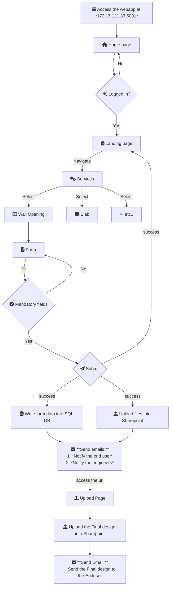

```mermaid
graph TD;
    A[fa:fa-globe Access the webapp at *172.17.121.33:5001*] --> Home[fa:fa-home Home page];
    Home --> Login{fa:fa-sign-in-alt Logged in?}
    Login -- Yes --> Landing[fa:fa-clipboard-list Landing page];
    Login -- No --> Home
    Landing -- Navigate --> Services[fa:fa-cogs Services]
    Services -- Select --> Wall[fa:fa-th-large Wall Opening]
    Services -- Select --> Slab[fa:fa-th Slab]
    Services -- Select --> etc[fa:fa-ellipsis-h etc..]
    Wall --> Form[fa:fa-file-alt Form]
    Form -- fill --> Mandatory{fa:fa-check-circle Mandatory fields}
    Mandatory -- No --> Form
    Mandatory -- Yes --> Submit{fa:fa-paper-plane Submit}
    Submit -- success --> Landing
    Submit{fa:fa-paper-plane Submit} -- success --> DB[fa:fa-database Write form data into SQL DB]
    Submit{fa:fa-paper-plane Submit} -- success --> Upload[fa:fa-upload Upload files into Sharepoint]
    DB --> Email[fa:fa-envelope]
    Upload --> Email[fa:fa-envelope **Send emails:**
    1. *Notify the end user*
    2. *Notify the engineers*]
    Email -- access the url --> Design[fa:fa-upload Upload Page]
    Design --> UploadFinal[fa:fa-upload Upload the Final design into Sharepoint]
    UploadFinal --> FinalEmail[fa:fa-envelope **Send Email:**
    Send the Final design to the Enduser]

```
